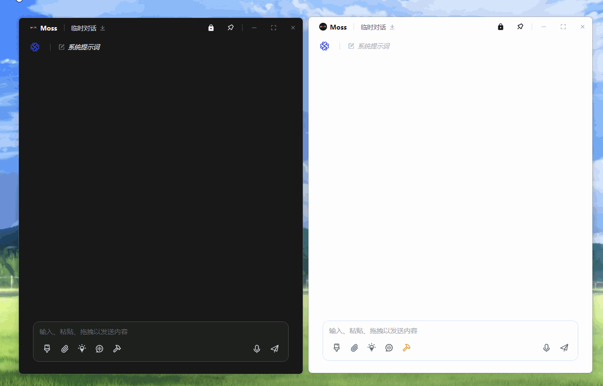
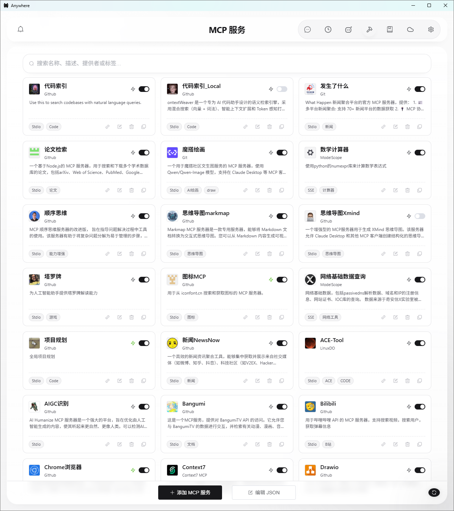

# ✨ AI Anywhere Desktop Docs - Anywhere Desktop 用户文档中心 🚀

> **随时随地，便捷召唤 AI！这里集中维护 Anywhere Desktop 的官方用户指南，覆盖快捷助手、全局追问、MCP、Skill、定时任务、历史对话、WebDAV 同步与桌面端专属配置。**

<p align="center">
  <a href="https://github.com/Komorebi-yaodong/anywhere_doc">
    
  </a>
  <a href="https://gitee.com/Komorebi-yaodong/anywhere_">
    
  </a>
  
</p>

本仓库不是桌面端主程序代码仓，而是 **Anywhere Desktop 的独立文档仓库**。它承载了桌面端主控台“使用指南”所需的在线 Markdown 文档与图片资源。

无论你是第一次接触 Anywhere Desktop，还是已经在用快捷助手、全局追问、MCP 工具和定时任务打造自己的本地 AI 工作流，这里都能帮助你快速找到对应说明。

---

## 📸 文档覆盖的核心功能

### 🚀 快捷输入 / 快捷召唤 / 全局追问

Anywhere Desktop 保留并强化了高频召唤 AI 的桌面体验：

* **快捷输入 (Fast Input)**：适合“阅后即焚”的轻量任务；
* **快捷召唤 (Quick)**：快速从多个助手中选择目标；
* **全局追问 (Append / Follow-up)**：把任意软件中的文本、图片、文件继续发送到已打开窗口。


### 💬 独立对话窗口与历史恢复

桌面端独立窗口支持多轮对话、文件拖拽、图片粘贴、自动保存、导出与恢复，让 AI 能真正作为长期协作窗口存在。



### 🧠 MCP 工具系统 / Skill / 定时任务

Anywhere Desktop 不只是聊天客户端，更是本地 AI 自动化工作站：

* **MCP**：让 AI 拥有文件、Shell、Python、联网与任务管理能力；
* **Skill**：把复杂流程封装为 SOP；
* **定时任务**：让 AI 在桌面端后台持续工作。



---

## 💡 本仓库的定位

本仓库主要服务于两个用途：

1. **为 Anywhere Desktop 主控台提供在线帮助文档源**  
   桌面端会直接读取这里的 `docs/*.md` 与 `image/*`。

2. **作为对外可访问的用户文档中心**  
   便于在 GitHub / Gitee 中直接浏览、分享和维护文档内容。

因此，文档文件名与路径需要保持稳定，避免桌面端内置索引失效。

---

## 📚 详细文档

我们为不同模块提供了独立文档，帮助你按功能深入阅读：

| 模块 | 说明 | 文档链接 |
| :-- | :-- | :-- |
| **定时任务** | 创建自动化任务，让 AI 定时执行并生成结果。 | [查看文档](./docs/task_doc.md) |
| **历史对话** | 管理本地与云端会话记录，支持恢复、清理与导出。 | [查看文档](./docs/chat_doc.md) |
| **快捷助手** | 创建不同类型的助手，掌握快捷召唤与全局追问。 | [查看文档](./docs/ai_doc.md) |
| **MCP 服务** | 启用内置工具，接入第三方 MCP 服务。 | [查看文档](./docs/mcp_doc.md) |
| **Skill 技能库** | 编写 SOP、封装技能、使用子智能体模式。 | [查看文档](./docs/skill_doc.md) |
| **服务商管理** | 配置 API 服务商、模型与多 Key 轮询。 | [查看文档](./docs/provider_doc.md) |
| **设置与同步** | 配置桌面行为、快捷键、语音与 WebDAV 同步。 | [查看文档](./docs/setting_doc.md) |

> 以上文档同时也是 Anywhere Desktop 主控台内“使用指南”的实际远程来源。

---

## 🗂️ 仓库结构

```text
Anywhere_doc/
├── README.md           # 文档首页
├── docs/               # 各功能模块文档
│   ├── ai_doc.md
│   ├── chat_doc.md
│   ├── mcp_doc.md
│   ├── provider_doc.md
│   ├── setting_doc.md
│   ├── skill_doc.md
│   └── task_doc.md
└── image/              # 文档配图与动图资源
```

### 维护约定

* `docs/*.md` 文件名尽量不要改动；
* 图片统一放在 `image/` 下；
* 每次更新文档时，建议同步更新文档内的 **文档更新时间**；
* 如桌面端帮助加载失败，请优先检查仓库路径、raw 地址与文件名是否仍一致。

---

## 🖥️ 与 Anywhere Desktop 的关系

当前 Anywhere Desktop 主控台中的“使用指南”已切换为从以下地址拉取：

* GitHub：`https://raw.githubusercontent.com/Komorebi-yaodong/anywhere_doc/main/`
* Gitee：`https://gitee.com/Komorebi-yaodong/anywhere_/raw/main/`

其中：

* `docs/*.md` 用于正文内容；
* `image/*` 用于文档中的截图、动图和演示图。

也就是说，这个仓库的任何文档更新，都可以直接影响桌面端主控台里最终展示的帮助内容。

---

## 🤝 社区与支持

Anywhere Desktop 是一个持续进化的开源项目，欢迎交流体验、反馈问题与完善文档。

* **GitHub 文档仓库**：[anywhere_doc](https://github.com/Komorebi-yaodong/anywhere_doc)
* **Gitee 文档镜像**：[anywhere_](https://gitee.com/Komorebi-yaodong/anywhere_)
* **桌面端主程序项目**：`Anywhere_desktop`（本 README 仅维护文档，不承载主程序代码）
* **QQ 交流群**：`1065512489`

如果你发现文档表述与桌面端现状不一致，欢迎直接提 Issue 或提交 PR。

---

## 📄 说明

本仓库中的内容主要用于 **Anywhere Desktop 官方用户文档分发与维护**。

如果你想参与主程序开发，请前往桌面端对应代码仓库；如果你想完善使用说明、术语表述、功能截图与教程结构，这里就是正确的维护位置。

欢迎一起把 Anywhere Desktop 的文档体验打磨得更清晰、更专业。